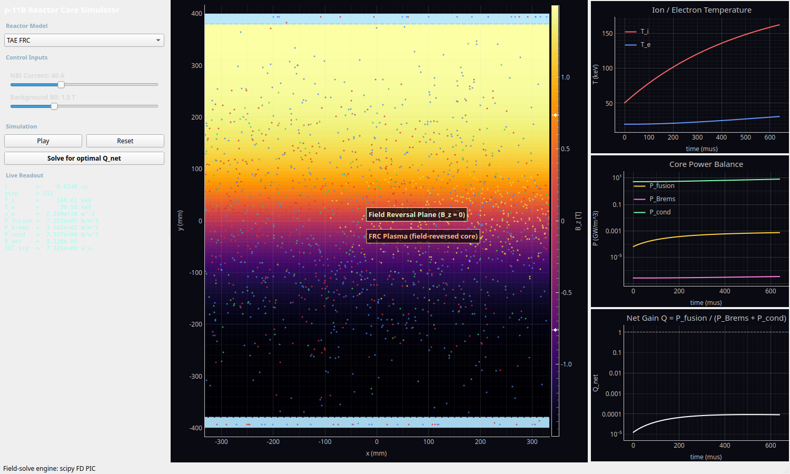
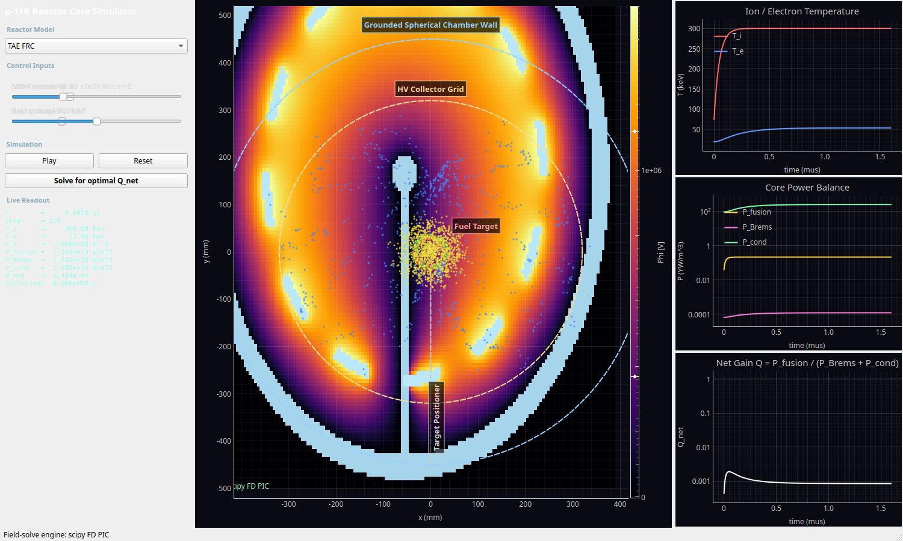
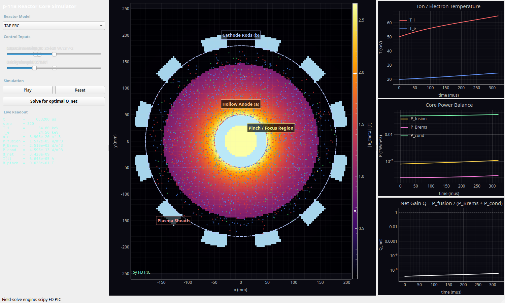

# p-11B Reactor Core Simulator -- Tutorial & Narrative Guide

This guide walks through the dashboard: the universal colored-particle legend,
then a narrative for each of the three reactor concepts (physical architecture,
control inputs, what the particles are doing, and the output measurements).

> Launch with `./pb11_reactor_sim/run.sh`, pick a reactor from the dropdown,
> press **Arm shot** to prepare a discharge (then walk away for coffee — the
> chamber is safe in **armed** standby), then **Fire** when ready. **Fire**
> auto-starts **Play** and runs the full countdown underneath, fast-forwarding
> through gas fill / coil ramp / T−3…2…1 until flat-top, pulse, or pinch at
> normal speed. Use **Skip to flat-top** (or pulse / pinch) if you want to
> jump straight to the show. **Reset** returns to unarmed idle.

---

## Arm / Fire operations (all reactors)

The simulator no longer starts mid-discharge. At launch the chamber is **unarmed**
(empty or cold). A real control-room sequence is approximated:

| Button | What it does |
|--------|----------------|
| **Arm shot** | Pre-shot prep: pump-down, gas fill, bank charge, target load, coils standby. Clears the diagnostic plots and sets **Ops = armed**. Safe standby — nothing discharges until **Fire**. |
| **Fire** | Runs the scripted countdown (status bar + Live Readout), **fast-forwarding** pre-discharge phases, then flat-top / pinch / laser pulse at normal speed. **Play** starts automatically until quiescence. |
| **Skip to …** | Visible during the countdown only. Jumps straight to flat-top (TAE), laser pulse (HB11), or pinch (LPP) with fields and particles already hot. |
| **Play / Pause** | Advance time manually while **armed** or **quiescent** (watch cooldown between shots). |
| **Reset** | Factory idle: default sliders, **unarmed**, empty chamber. |

### Can you Fire more than once per Arm?

| Reactor | Re-Arm required? | Practice |
|---------|------------------|----------|
| **TAE FRC** | **No** | After quiescence you may **Fire again** on the same arm (shortened re-heat sequence). Mimics repeated discharges in one experimental day without full vacuum break. |
| **HB11 Laser** | **Yes** | Each shot consumes the target block; **Arm** loads a fresh target and re-conditions the chamber. |
| **LPP DPF** | **Yes** | The capacitor bank is depleted after a shot; **Arm** recharges the bank and refills gas. |

Between shots, leave **Play** on during **quiescent** to watch temperatures fall, particles drain, and fields relax before the next **Fire** (or **Arm** on HB11/LPP).

The **Status** line in Live Readout is the operator callout (e.g. `T−1: NBI on`, `PINCH — focus on axis`). Countdown labels like **T−5 s** are control-room shorthand, not wall-clock seconds — pre-discharge sim time is compressed so you reach the discharge in a few seconds of real time, not a minute.

---

## The p-¹¹B reaction is a 4-stage chain (and why that matters here)

It is tempting to write the reaction as a single step, `p + ¹¹B → 3α + 8.7 MeV`.
In reality it is a **sequential decay through short-lived intermediate nuclei**,
and that internal structure is what gives the fusion products their
characteristic energy distribution.

### The four stages

```
  Stage 1: ¹H + ¹¹B  →  ¹²C*                 (fusion forms an excited compound nucleus)
  Stage 2: ¹²C*      →  α  +  ⁸Be(*)         (emits the PRIMARY alpha)
  Stage 3:                ⁸Be(*)             (the recoil nucleus, itself unbound)
  Stage 4:                ⁸Be(*) →  α + α     (breaks up into two SECONDARY alphas)
```

Net result: **3 alphas** sharing the ~8.7 MeV release -- but they are emitted in
**two distinct steps**, so they do not come out with equal energies.

Stage 2/3 actually has two competing branches, depending on which state of ⁸Be
is left behind:

- **α₁ branch (~90%):** `¹²C* → α₁ + ⁸Be*(2⁺, 3.03 MeV) → α₁ + 2α`
- **α₀ branch (~10%):** `¹²C* → α₀ + ⁸Be(0⁺, ground state) → α₀ + 2α`

### Time scales of the intermediates

The intermediate nuclei exist for an extraordinarily short time -- set by their
quantum level width via `τ = ℏ / Γ`:

| Intermediate | Decays to | Width Γ | Lifetime τ = ℏ/Γ |
|---|---|---|---|
| **¹²C\*** (compound nucleus, ~16.6 MeV) | α + ⁸Be | ~0.3 MeV | **~10⁻²¹ – 10⁻¹⁸ s** |
| **⁸Be\*** (2⁺, 3.03 MeV) | 2α | ~1.5 MeV | **~4×10⁻²² s** |
| **⁸Be** (0⁺ ground state) | 2α | 5.57 eV | **~8×10⁻¹⁷ s** |

Even the longest-lived of these (⁸Be ground state, ~10⁻¹⁶ s) decays about
50,000× faster than the shortest simulation timestep (HB11's `dt = 5 ps`), and
travels only a fraction of a nanometre before breaking up. **So the simulator
does not transport ¹²C\* or ⁸Be as particles at all** -- treating the reaction
as instantaneous (`p + ¹¹B → 3α`) is fully justified, not a shortcut. What the
simulator *does* keep is the kinematic fingerprint those stages leave on the
alphas.

### The alpha energy distribution

Because the primary alpha (Stage 2) and the two secondary alphas (Stage 4) are
born from different two-body decays, they populate different energy ranges. The
aggregate per-alpha spectrum is modeled as a **weighted sum of Gaussians**, one
per emitted-alpha population:

```
f(E) = Σ_k  w_k · N(E ; μ_k, σ_k)
```

| Component (k) | Origin | μ_k [MeV] | σ_k [MeV] | weight w_k |
|---|---|---|---|---|
| α₁ primary    | Stage 2, α₁ branch | 3.76 | 0.30 | 0.90 × 1/3 |
| α₁ secondary  | Stage 4, ⁸Be\*(3.03) breakup | 2.46 | 1.00 | 0.90 × 2/3 |
| α₀ primary    | Stage 2, α₀ branch | 5.70 | 0.30 | 0.10 × 1/3 |
| α₀ secondary  | Stage 4, ⁸Be(g.s.) breakup | 1.43 | 0.50 | 0.10 × 2/3 |

The weights are normalized to 1; the `1/3 : 2/3` split reflects one primary plus
two secondary alphas per reaction. By construction the mean alpha energy is

```
⟨E_α⟩ = Σ_k w_k μ_k ≈ 2.89 MeV    ⇒    3 ⟨E_α⟩ ≈ 8.7 MeV
```

so the total released energy is conserved on average, while individual alphas
range from ~0 to ~6.8 MeV with the well-known broad peak near ~3.8 MeV. This is
implemented in [`physics/processes.py`](physics/processes.py) as
`sample_alpha_energies_J(n, rng)`.

### Why representing the distribution improves fidelity

The whole point of p-¹¹B is **direct energy conversion** of the charged alphas
to electricity (TAE's ICC, HB11's electrostatic collector grid). A direct
converter is an *energy filter*: a decelerating potential `V` turns back any
alpha whose kinetic energy is below `2eV` and collects the rest. If every alpha
had the same energy `8.7/3 ≈ 2.9 MeV`, the converter response would be an
unphysical step function -- all-or-nothing at one grid voltage.

With the real spectrum, the model behaves like the real machine:

- **Energetic primary alphas (~3.8–5.7 MeV)** punch through higher decelerating
  potentials -- so HB11's `Collected` charge and TAE's `ICC sig` keep responding
  as you raise the grid voltage toward 3 MV.
- **Soft ⁸Be-breakup secondaries (~1–2.5 MeV)** are turned back at lower
  voltages, shaping the collection-efficiency-vs-voltage curve.

In short: modeling the 4-stage chain lets the **direct-conversion diagnostics
respond to a voltage sweep the way a real collector would**, which is exactly
the engineering question these reactors are built to answer.

---

## The colored dots (macroparticles)

Every reactor renders live **macroparticles** -- each dot represents a large
swarm of real particles (a "macroparticle weight") so that millions of physical
particles can be visualized with a few thousand dots. The color encodes the
species, and the color key is identical across all three reactors:

| Color | Species | Charge | What it represents |
|-------|---------|--------|--------------------|
| **Red** | Proton (`p`, ¹H) | +1e | The light fuel ion. |
| **Green** | Boron-11 (`B`, ¹¹B) | +5e | The heavy fuel ion (Z = 5 -- the big Bremsstrahlung driver). |
| **Yellow** | Alpha (`α`, ⁴He) | +2e | Fusion *product*. Each p-¹¹B reaction makes 3 alphas sharing 8.7 MeV. |
| **Blue** | Electron (`e`) | −1e | Neutralizing electrons; their temperature `T_e` sets the radiation losses. |

Reading the motion:
- **Red + Green** dots are the reacting fuel. Where they overlap densely and are
  hot, fusion happens.
- **Yellow** dots *appear over time* -- they are born from fusion events and then
  stream toward a collector (TAE/HB11) or out of the pinch (LPP). Watching yellow
  accumulate is watching the reactor produce energy.
- **Blue** dots track the electron cloud. In the aneutronic concepts the whole
  game is keeping the blue population *colder* than the fuel ions.

The bright **cyan/white shapes** are not particles -- they are the **solid
conductor structures** (walls, electrodes, grids, targets), drawn as
high-contrast overlays and labeled with text.

> The yellow alphas are **not** monoenergetic -- they are sampled from the real
> p-¹¹B energy spectrum produced by the 4-stage decay chain described at the top
> of this guide. That is why the direct-conversion diagnostics (TAE `ICC sig`,
> HB11 `Collected` charge) respond realistically to a grid-voltage sweep.

---

## Universal output measurements (right-hand diagnostic panel)

All three reactors report the same coupled core-process equations, evaluated
every timestep. These feed the three linked real-time plots and the "Live
Readout" text box on the left.

1. **Ion / Electron Temperature** (`T_i`, `T_e`, in keV) -- the top plot.
   The central tension of p-¹¹B: ion temperature must reach ~150-300 keV for
   fusion, while electron temperature should stay low to limit radiation.

2. **Core Power Balance** (W/m³, log scale) -- the middle plot:
   - `P_fusion = n_p n_B ⟨σv⟩ E_f` with `E_f = 8.7 MeV` (yellow).
   - `P_Brems` = relativistic Bremsstrahlung radiation loss (pink):
     `1.57e-40 · Z_eff² · n_e² · √T_e · (1 + 1.71 T_e/m_e c²)`.
   - `P_cond` = conductive/transport energy loss `3 n_e T_e / τ_E` (green).

3. **Net Gain `Q`** (log scale) -- the bottom plot:
   `Q = P_fusion / (P_Brems + P_cond)`. The dashed line marks `Q = 1`
   (scientific breakeven). For thermal p-¹¹B this sits stubbornly below 1 --
   that is the famous **Rider limit**, and it is *supposed* to be hard.

Each reactor also adds a couple of **machine-specific readouts** in the Live
Readout box (described per reactor below).

---

## 1. TAE FRC -- Field-Reversed Configuration



### Physical architecture being modeled

This reactor is a **2D axis-aligned slice** through a cylindrical FRC machine —
the horizontal axis **`x`** is the machine (axial) direction; the vertical axis
**`y`** is the radial-like coordinate across the **field-reversal plane** (an
*r–z* meridian collapsed to *x–y* for visualization).

| Element | Model |
|---------|--------|
| **Domain** | 1.2 m × 0.8 m window (`x ∈ [−0.6, +0.6] m`, `y ∈ [−0.4, +0.4] m`), 181×121 cells |
| **Conducting wall** | Thin grounded shell on the top, bottom, and left boundaries (cyan lines) |
| **ICC collector** | **8 segmented electrodes** on the **+x** end wall — alphas are absorbed here |
| **FRC core** | Interior plasma; field reverses on the midplane `y ≈ 0` |
| **Timestep** | 2 ns (flat-top holds ~25 µs simulated ≈ 12 ms wall time at normal speed) |

During a shot the coil ramp is modeled by a dimensionless scale **`b_scale(t)`**
(0 at Arm → 1 at flat-top) that multiplies the slider **`B0`**:

\[
B_z(x,y,t) = B_0 \cdot b_{\mathrm{scale}}(t) \cdot \tanh\!\left(\frac{y}{y_s}\right),
\qquad y_s = 0.12\ \mathrm{m}
\]

The colormap is **`B_z`**: yellow/positive at the top, purple/negative at the
bottom, with the **field-reversal plane (`B_z = 0`)** through the centre. Macroparticle
positions sample a **`sech²(y/y_s)`** density profile (implemented as a Gaussian
with σ ≈ `y_s`).

**TAE-specific hardware narrative in this slice:**
- **Neutral Beam Injection (NBI)** enters from the **−x** side and deposits **MeV-class
  fast protons** (red dots with a narrow +x velocity cone).
- Fusion **alphas (yellow)** are born in the core and stream **+x** toward the
  **Inverse Cyclotron Converter (ICC)**.
- At the ICC, alphas crossing segmented electrodes induce an **AC pickup signal**
  (`ICC sig` in the readout) — a stand-in for **direct conversion** of charged
  fusion-product energy to electricity (no steam cycle, no neutrons).

The simulator couples a **2D PIC macroparticle view** (what you see bouncing) to a
**0D power-balance model** (what drives the `Q_net` plot and optimizer). The two
are intentionally aligned but not yet fully self-consistent in every detail (e.g.
ICC recovery is counted in 0D before every alpha macroparticle reaches the collector).

### Control inputs (sliders)

| Slider | Range | Default | Effect |
|--------|-------|---------|--------|
| **NBI Current** | 0–120 A | 40 A | Beam current (normalized). Sets beam energy, fast-ion fraction, **`P_NBI`**, and PIC injection rate. |
| **Background B0** | 0.1–5.0 T | 1.5 T | Peak `\|B_z\|` at flat-top (`b_scale = 1`). Enters **`τ_E`**, bulk **`T_i`**, and core density. |
| **ICC Coupling** | 0.50–0.95 | 0.85 | **`η_ICC`**: fraction of fusion power recovered as electricity at the collector. |

### 2D particle dynamics (PIC slice)

Macroparticles for **p**, **¹¹B**, **e⁻**, and **α** are advanced each sub-step with
a **Boris push** in the local **`B_z(y)`** (no in-plane electric field during flat-top).

**Boundaries**
- **Radial walls** (`y` limits): specular reflection of `v_y`.
- **−x wall**: specular reflection of `v_x`.
- **+x wall**: fuel ions reflect; **alphas are collected** when `x` reaches the ICC plane
  (`x_ICC ≈ x_max − 0.04 m`), incrementing **`ICC sig ∝ Σ|v_x|`** of collected alphas.

**NBI injection** (during `nbi_heat` and flat-top, when `nbi_scale > 0`):

Beam energy from the slider (matches the 0D model):

\[
E_{\mathrm{beam\,[keV]}} = 250 + 320\left(\frac{I_{\mathrm{NBI}}}{120}\right)^{0.85}
\]

Protons spawn at the left edge with **`v_x = √(2 E_beam / m_p)`** and a small transverse
spread (`σ_v ≈ 0.08 v_x`). Injection rate scales with **`I_NBI`**.

**Fusion alphas in PIC** spawn at a rate tied to **`P_fusion`**, with kinetic energies
sampled from the **p–¹¹B sequential-decay spectrum** (alpha0/alpha1 branches through
¹²C* and ⁸Be — see *Alpha spectrum* below), launched in a narrow forward (+x) cone.

### 0D plasma state (flat-top scalars)

During flat-top the bulk scalars relax toward:

\[
T_{i,\mathrm{target}} = 40 + 0.35\,E_{\mathrm{beam\,[keV]}} + 18\,B_0\ \ \mathrm{[keV]}
\]

\[
T_{e,\mathrm{target}} = \min\!\bigl(12 + 0.04\,T_i,\ 0.18\,T_i\bigr)\ \ \mathrm{[keV]}
\]

\[
n_e = 3.0\times10^{20}\left(0.55 + 0.45\,\frac{B_0}{5}\right)\ \ \mathrm{m^{-3}}
\]

Fuel fractions: **`n_p = 0.55 n_e · (1 + 0.08 f_beam)`**, **`n_B = 0.09 n_e`**, with

\[
f_{\mathrm{beam}} = \min\!\left(0.72,\ 0.10 + 0.62\,\frac{I_{\mathrm{NBI}}}{120}\right)
\]

(fraction of protons in the non-thermal beam population used by the power balance).

### Power balance and gain (TAE-specific)

The **`Q_net`** plot and **Solve for optimal Q_net** use **system gain** for TAE:

\[
\boxed{
Q_{\mathrm{sys}} =
\frac{P_{\mathrm{ICC}}}{P_{\mathrm{NBI}} + P_{\mathrm{Brems}} + P_{\mathrm{transport}}}
}
\]

\[
Q_{\mathrm{plasma}} =
\frac{P_{\mathrm{fusion}}}{P_{\mathrm{Brems}} + P_{\mathrm{transport}}}
\]

(`Q_plasma` is shown in the Live Readout; HB11/LPP use `Q_plasma`-style gain only.)

#### Beam-driven sustainment (required — not a slider floor)

TAE's Norm result is **NBI-only FRC formation**: the reversed field is **created and
held by beam-driven current**, not by external coils alone. The model captures this
with a sustainment fraction **`S(I_NBI, B0) ∈ [0, 1]`**:

\[
S = \underbrace{\mathrm{smoothstep}\!\left(\frac{I_{\mathrm{NBI}} - 30\ \mathrm{A}}{25\ \mathrm{A}}\right)}_{\text{beam holds reversal}}
\times \underbrace{\left(0.70 + 0.30\,\frac{B_0}{5\ \mathrm{T}}\right)}_{\text{B₀ assists confinement once FRC exists}}
\]

**`B₀` cannot substitute for beams** — if **`I_NBI < ~30 A`**, **`S → 0`**: the FRC
does not maintain reversal regardless of field strength.

When **`S`** is low:
- **`τ_E`** collapses (**`∝ S²`**) — confinement time shortens  
- **End/transport losses** rise (**`∝ 1 + 12(1−S)²`**) — open field lines, tilt  
- **Beam-target fusion** scales with **`S`** (overlap + trapping)  
- **Thermal fusion tail** scales with **`S²`** (no free fusion from a cold/decaying FRC)  
- Bulk **`T_i`**, **`n_e`**, and PIC **`B_z` amplitude** scale with **`S`**

There is **no hard minimum current** — low NBI is legal but **self-penalizing**. During the
shot, **`nbi_scale(t)`** ramps from 0 → 1 over the **NBI on** phase; all sustainment,
fusion, **`P_NBI`**, and **`T_i`** scale with **`S × nbi_scale(t)`** so **`Q_sys` rises
smoothly** rather than stepping at phase boundaries.

The optimizer therefore moves to **~55–90 A** (full sustainment) rather than minimizing
beam cost at ~10 A.

**Two different Q metrics** (both plotted on the bottom-right chart):
- **`Q_sys` (solid white)** — plant gain: **`η_ICC · P_fusion / (P_NBI + losses)`**. This
  is what must cross 1 for net electricity; it stays **~1.5–1.7** at optimum because
  **`P_NBI`** is in the denominator.
- **`Q_plasma` (dashed yellow)** — fusion physics only: **`P_fusion / losses`**. This can
  reach **10+** when **`T_i`** is hot — it is *not* breakeven for the wall plug.

#### Fusion power

**Beam–target channel** (dominant — uses beam energy, not bulk `T_i`):

\[
P_{\mathrm{beam}} =
\mathcal{E}_{\mathrm BT}\;
n_{\mathrm{beam}}\,n_B\;
\langle\sigma v\rangle(E_{\mathrm{beam}})\;
E_f,
\qquad
n_{\mathrm{beam}} = f_{\mathrm{beam}}\,n_p,
\qquad
\mathcal{E}_{\mathrm BT} = 4.5
\]

**Thermal tail** (small Maxwellian contribution from the slow ion population):

\[
P_{\mathrm{thermal}} =
0.12\;
n_{p,\mathrm{thermal}}\,n_B\;
\langle\sigma v\rangle(T_{i,\mathrm{thermal}})\;
E_f
\]

\[
P_{\mathrm{fusion}} = P_{\mathrm{beam}} + P_{\mathrm{thermal}},
\qquad
E_f = 8.7\ \mathrm{MeV\ per\ reaction}
\]

Reactivity **`⟨σv⟩`** is a log-parabola fit peaking near **300 keV**:

\[
\log_{10}\langle\sigma v\rangle =
-21.5 - 2.0\left[\log_{10} T - \log_{10} 300\right]^2
\quad (T\ \mathrm{in\ keV})
\]

#### ICC recovery (output)

p–¹¹B releases essentially all energy in **three charged alphas** (no neutrons):

\[
P_{\mathrm{ICC}} = \eta_{\mathrm{ICC}}\,P_{\mathrm{fusion}}
\]

#### NBI input

\[
P_{\mathrm{NBI}} =
\frac{1.35\times10^{5}\,\left(I_{\mathrm{NBI}}/120\right)^{1.35}\,\left(E_{\mathrm{beam\,[keV]}}/400\right)}
{V_{\mathrm{plasma}}},
\qquad
V_{\mathrm{plasma}} \approx \pi y_s^2 L_x \cdot 0.85 \approx 0.05\ \mathrm{m^3}
\]

#### Bremsstrahlung (relativistic)

\[
P_{\mathrm{Brems}} =
1.57\times10^{-40}\,Z_{\mathrm{eff}}^2\,n_e^2\,\sqrt{T_e}\,
\left(1 + 1.71\,\frac{T_e}{m_e c^2}\right)
\]

with **`Z_eff = (n_p + 25 n_B) / n_e`**. Low **`T_e`** (decoupled from beam-heated ions)
keeps this term small — the intended Rider workaround.

#### Transport (thermal populations only)

Fast beam ions are **excluded** from the loss inventory (they fuse before equilibrating):

\[
P_{\mathrm{transport}} =
\frac{\frac{3}{2}\,k_B\!\left(n_{e,\mathrm{loss}} T_e + n_{i,\mathrm{loss}} T_{i,\mathrm{thermal}}\right)}
{\tau_E}
\]

with **`n_e,loss = min(n_e, 4×10¹⁹ m⁻³)`**, **`n_i,loss = min(n_p,thermal, 0.55×4×10¹⁹)`**,
and **`T_i,thermal = min(T_i, 0.22 E_beam + 15 keV)`**.

Energy confinement time (FRC-scaled, grows with **`B0`** and NBI sustainment):

\[
\tau_E =
6.0\times10^{-3}\left(\frac{B_0}{1.5}\right)^{2.4}
\left(1 + 0.75\,\frac{I_{\mathrm{NBI}}}{120}\right)\times 18\ \ \mathrm{s}
\]

#### Alpha spectrum (PIC birth energies)

Each fusion event produces **three alphas** via sequential decay:

| Branch | Weight | Primary α | Secondaries (×2) |
|--------|--------|-----------|------------------|
| **alpha1** | ~90% | ~3.76 MeV | broad ~2.46 MeV (⁸Be* breakup) |
| **alpha0** | ~10% | ~5.70 MeV | ~1.43 MeV (⁸Be ground state) |

Macroparticle alphas draw from this four-component mixture; total kinetic energy
averages **~8.7 MeV per reaction**.

#### ICC AC signal (readout)

\[
\mathrm{ICC\ sig} \leftarrow 0.97\,\mathrm{ICC\ sig} + 0.01\sin\phi,
\qquad
\frac{d\phi}{dt} = 2\pi\left(10^6 + 2\times10^4\,I_{\mathrm{NBI}}\right)
\]

plus increments proportional to collected alpha **`|v_x|`**. Units are arbitrary —
it is a qualitative direct-conversion waveform, not a calibrated MW readout.

### What the dots do

Red / green / blue macroparticles **gyrate** in **`B_z`** (Boris pusher), concentrated
near the midplane. NBI continuously adds **fast red protons** from the left. Yellow
alphas are born near the core and drift **+x**; many are collected at the ICC segments.

### Machine-specific readout (Live Readout extras)

| Field | Meaning |
|-------|---------|
| **`Sustain`** | Beam-driven FRC hold fraction **`S(I_NBI, B0)`** — see sustainment section |
| **`P_NBI`** | Modeled beam input power density [W/m³] |
| **`P_ICC`** | **`η_ICC · P_fusion`** — recovered output power density |
| **`Q_plasma`** | Fusion vs radiation + transport (no NBI/ICC accounting) |
| **`Q_sys`** | Same as **`Q_net`** plot for TAE |
| **`ICC sig`** | AC pickup from alphas crossing ICC segments |

### On-screen HUD and MP4 export

The plot shows a **bold black frame counter** (top-left of the canvas):
**`Frame N [FF×35 …]`** during the pre-flat-top countdown, **`[FF×10 …]`** during
the long flat-top hold, **`[FF×4 …]`** during ramp-down, then **`[1× …]`** for any
1× segments. Use it to see when the GUI is compressing sim time vs running in real time.
advancing 35× more simulation time per tick.

**Record MP4** (control panel): captures the **spatial canvas plus the three
right-hand graphs** (temperature, power balance, Q). Control panel is excluded.
On save, export runs **narration-first**: ChatTTS callouts are synthesized, then each
phase is **held** for at least ``speech + 1.5 s`` so nothing is cut off. White
**subtitles** show the callout text. Reactor bed audio is **2× louder**, ducked to
the prior level during voice. Set ``PB11_SKIP_NARRATION=1`` for bed-only export.
Requires **ffmpeg** on PATH.
Recommended workflow (keeps optimized sliders — no Reset needed):

1. **Solve for optimal Q_net**
2. **Record ON**
3. **Arm shot**
4. **Fire** (Play starts automatically; recording captures from here)
5. **Record OFF** → save dialog

Toggle recording before Fire is fine — pre-Fire idle frames are **not** captured, and the buffer **clears at Fire** so the MP4 is just the discharge. **Reset** restores factory slider defaults; skip it if you want to keep the optimized settings.

### Operational sequence (Arm → Fire → quiesce)

**Arm (pre-shot)**  
Vacuum vessel, neutral gas puff, coils at standby (`b_scale ≈ 0.12`, weak **`B_z`**).
Cold gas macroparticles visible; diagnostics cleared.

**Fire countdown** (automatic; pre-discharge phases fast-forward in the GUI)

| Phase | Sim duration | What happens |
|-------|--------------|--------------|
| Gas fill | 0.8 µs | Fuel inventory rises |
| Coil ramp | 2.0 µs | **`b_scale → 1`**, **`B_z`** rises |
| FRC formation | 3.0 µs | Hot plasma macroparticles seeded |
| NBI on | 4.0 µs | **`nbi_scale → 1`**, beam injection begins |
| **Flat-top** | 25 µs | Full discharge; fusion, ICC alphas, diagnostics |
| Ramp-down | 4 µs | Beams and field fall |

**Quiescent (post-shot)**  
Plasma cools and particles drain. **Fire again without re-Arm** (shortened re-ramp).
TAE is the only reactor that allows repeat **Fire** from quiescence without a fresh **Arm**.

**Typical cadence:** *Standby → Arm → (coffee) → Fire → flat-top → quiesce → Fire …*

### Real-world status vs this model

As of **2025**, TAE has demonstrated **NBI-only FRC formation and sustainment** on
**Norm** ([Nature Communications, April 2025](https://doi.org/10.1038/s41467-025-58849-5)),
but has **not** reported **`Q ≥ 1`**. **Copernicus** is targeted toward net-energy
demonstration later this decade.

This simulator implements TAE's **proposed** aneutronic pathway — beam-target fusion,
cold electrons, ICC direct conversion — so **`Q_sys > 1`** is **achievable in the model**
when you **Solve for optimal Q_net** (typically high **`B0`**, strong **`η_ICC`**, and
**NBI ~ 60–90 A** for a Norm-like operating point). That is a **design exploration**,
not a claim about current hardware.

---

## 2. HB11 Laser -- Laser-Driven Block Ignition



### Physical architecture being modeled
A **2D slice through a spherical reaction chamber**. The outer cyan ring is the
**grounded spherical chamber wall**. A small solid **fuel target** sits at the
center on a thin **target positioner** stalk. Surrounding the target is a
**high-voltage spherical collector grid** -- drawn as the dashed cyan arcs
(it is a *grid*, with gaps, so particles can pass while it holds a high bias).

The displayed field colormap is the **electrostatic potential `Φ`**, obtained by
solving Poisson's equation `∇²Φ = −ρ/ε₀` with the grid pinned at the slider
voltage. You can see the potential well/hill the grid creates.

Two physics processes drive it:
- **Ponderomotive block acceleration:** a localized 2D Gaussian laser pulse
  hits the target and ejects fuel via the ponderomotive force
  `F_p = −(e²/4 m_e ω²) ∇⟨E²⟩`. On picosecond timescales the ions are pushed
  out as a directed "block" before electrons can thermalize -- this is how HB11
  tries to beat the Rider limit (note `T_e` stays much lower than `T_i`).
- **Electrostatic deceleration / direct collection:** outward ions climb the
  grid's potential, are decelerated, and their charge is **collected on the
  grid** as DC current.

### Control inputs (sliders)
| Slider | Range | Default | Effect |
|--------|-------|---------|--------|
| **Laser Intensity** | 1-100 (×10²⁰ W/cm²) | 30 | Strength of the ponderomotive drive. Higher intensity ejects the fuel block harder and drives `T_i` up toward ~300+ keV. |
| **Grid Voltage** | 0-3 MV | 1.5 MV | Bias on the collector grid. Higher voltage decelerates the escaping ions more strongly and collects more charge (the potential field colormap deepens). |

### What the dots do
A cold fuel **block** (red protons + green boron, with blue electrons) starts as
a thin shell on the target. The laser blows it outward; ions decelerate against
the grid potential and are collected. Yellow alphas appear from fusion in the
compressed core and radiate outward. The block is replenished so the run
sustains.

### Machine-specific readout
- **`Collected`** -- total DC charge (Coulombs) accumulated on the collector
  grid. This is the direct-conversion energy harvest.

### Operational sequence (Arm → Fire → quiesce)

**Arm (pre-shot)**  
Chamber pumped, **grid at V_grid**, fresh **fuel target** loaded (cold block on the stalk — green/red/blue dots on the target). No laser power yet.

**Fire countdown**

1. Grid charge — verify high-voltage stand  
2. Laser countdown — `T−3…2…1` (chain armed)  
3. **Main pulse** — ponderomotive block ejection + heating (`Laser Intensity` slider)  
4. Afterglow — plasma cools, collection completes  

**Quiescent**  
Target is spent. **You must Arm again** before the next Fire (new target + pump-down).

**Typical cadence:** *Arm → laser clear → Fire → shot → Arm (new target) → Fire …*

---

## 3. LPP DPF -- Dense Plasma Focus



### Physical architecture being modeled
A **2D cross-section perpendicular to the electrode axis** of a coaxial gun.
At the center is the **hollow anode** (inner radius `a`); around the outside is
a ring of **cathode rods** at radius `b` (the cyan blocks). A capacitor bank
discharges across them, forming a **plasma sheath** that is driven inward and
collapses onto the axis as a dense **pinch/focus**.

The displayed field colormap is the **azimuthal magnetic field magnitude**
`|B_θ| = μ₀ I / (2π r)` -- brightest at the center where the current pinches,
falling off as `1/r` outward. Two physics processes drive it:
- **Snowplow sheath dynamics:** the sheath position is integrated from
  `d/dt(M(z) · dz/dt) = μ₀ I(t)² / (4π) · ln(b/a)`, with a ringing RLC current
  `I(t)` set by the capacitor voltage and a swept mass set by the gas pressure.
- **Quantum Magnetic Bremsstrahlung Suppression:** when the pinch field exceeds
  `B_crit = 10⁵ T`, radiation is suppressed by `P_Br · exp(−B/B_crit)`. (At
  realistic DPF currents the field stays well below this extreme threshold, so
  the hook is present but rarely triggers -- as in reality.)

### Control inputs (sliders)
| Slider | Range | Default | Effect |
|--------|-------|---------|--------|
| **Capacitor Voltage** | 10-60 kV | 35 kV | Peak bank current (mega-ampere class). Higher voltage means stronger drive, a tighter/hotter pinch, larger `|B_θ|`, and higher `T_i`. |
| **Gas Pressure** | 0.5-20 Torr | 6 Torr | Fill pressure of the H-B mixture. Sets the swept mass (snowplow inertia) and the plasma density `n_e`. |

### What the dots do
Red/green fuel ions and blue electrons fill the inter-electrode gap and are swept
**inward** with the collapsing sheath (you can watch them migrate toward the axis
as `I(t)` rings up). Ions reflect off the anode surface and are absorbed at the
cathode radius. Yellow alphas are produced in the dense pinch.

### Machine-specific readouts
- **`I(t)`** -- the instantaneous bank current (Amps).
- **`B_pinch`** -- the peak azimuthal field at the collapsing sheath (Tesla).
  Watch this rise as the sheath radius shrinks toward the anode.

### Operational sequence (Arm → Fire → quiesce)

**Arm (pre-shot)**  
Gas fill at slider **Gas Pressure**, **capacitor bank charged** (`I(t) ≈ 0`), cold fuel ions in the gap between anode and cathode.

**Fire countdown**

1. Gas fill — confirm inventory in the coaxial gap  
2. **Trigger** — switch closes; discharge clock starts  
3. Run-down — snowplow sheath accelerates inward (`I(t)` rises)  
4. **Pinch** — focus on axis; `B_pinch` peaks; fusion burst  
5. Disrupt — plasma hits anode; energy release  
6. Recovery — bank depleted, plasma cooling  

**Quiescent**  
Bank empty. **Arm again** (recharge + refill) before the next Fire.

**Typical cadence:** *Charge → Arm → 3-2-1 Fire → bang → quiesce → Arm → Fire …*

---

## Suggested first experiments

1. **TAE FRC:** **Arm shot** → **Fire** → watch formation then flat-top; after quiescence,
   **Fire** again without re-Arm. Then raise **NBI Current** to ~100 A on a new Arm/Fire.
   Watch `T_i` climb on the top plot and red beam ions stream in from the left.
   Then raise **B0** and note the tighter gyro-orbits and improved confinement.

2. **HB11 Laser:** crank **Laser Intensity** to ~80 and watch the fuel block
   explode outward while `T_i` rockets toward 300 keV but `T_e` stays low (the
   non-thermal advantage). Raise **Grid Voltage** to 3 MV and watch `Collected`
   charge grow in the readout.

3. **LPP DPF:** raise **Capacitor Voltage** to 60 kV and watch `I(t)` and
   `B_pinch` grow and the central `|B_θ|` colormap brighten as the sheath
   collapses. Lower the **Gas Pressure** to make the lighter sheath collapse
   faster.

In every case, glance at the **`Q_net`** plot. Seeing it sit below the `Q = 1`
line is the whole point of p-¹¹B research -- this simulator lets you feel, in
real time, exactly how hard aneutronic breakeven is and which knobs move it.

---

## The "Solve for optimal Q_net" button

If you do not yet have intuition for what the sliders do, press **Solve for
optimal Q_net**. The optimizer searches *that reactor's own* control space
(whatever sliders it exposes) for the combination that maximizes the
steady-state net gain `Q`, then moves the sliders there for you and reports the
result in the status bar.

How it works:
- It evaluates only the fast **0D plasma-state model** (the same `T_i`/`T_e`,
  density, and power-balance equations that drive the `Q_net` plot), so it does
  **not** need to run the particle simulation -- a full sweep takes ~0.5-5 s.
- It runs a coarse grid sweep over the slider ranges, then a local refinement
  pass around the best point, in a **background thread** so the GUI stays
  responsive (the button shows "Optimizing...").
- The result is applied to the live sliders, so you can immediately watch the
  optimized plasma evolve and then hand-tune from there.

Things you will learn from it:
- **TAE FRC** favors high **B0**, strong **ICC Coupling**, and **NBI ~ 55–90 A**
  (beam sustainment threshold). Below ~30 A the FRC does not hold; the optimizer
  discovers this from physics, not a floor constraint.
- **HB11 Laser** is essentially insensitive to **Grid Voltage** for core `Q`
  (the grid governs *energy collection*, not the fusion balance), and prefers a
  moderate **Laser Intensity** -- a vivid illustration that hotter is not always
  better once Bremsstrahlung scales up.
- **LPP DPF** likes higher **Gas Pressure** (more fuel density) and an
  intermediate **Capacitor Voltage**.

Thermal p-11B remains Rider-limited if you treat it as a Maxwellian plasma with
no beam channel and no ICC recovery. **TAE FRC** is the exception in this
simulator: its `Q_net` is **`Q_sys`**, and the optimizer can push it above 1 when
the proposed physics knobs align. HB11 and LPP still optimize below breakeven
under their respective 0D models.
