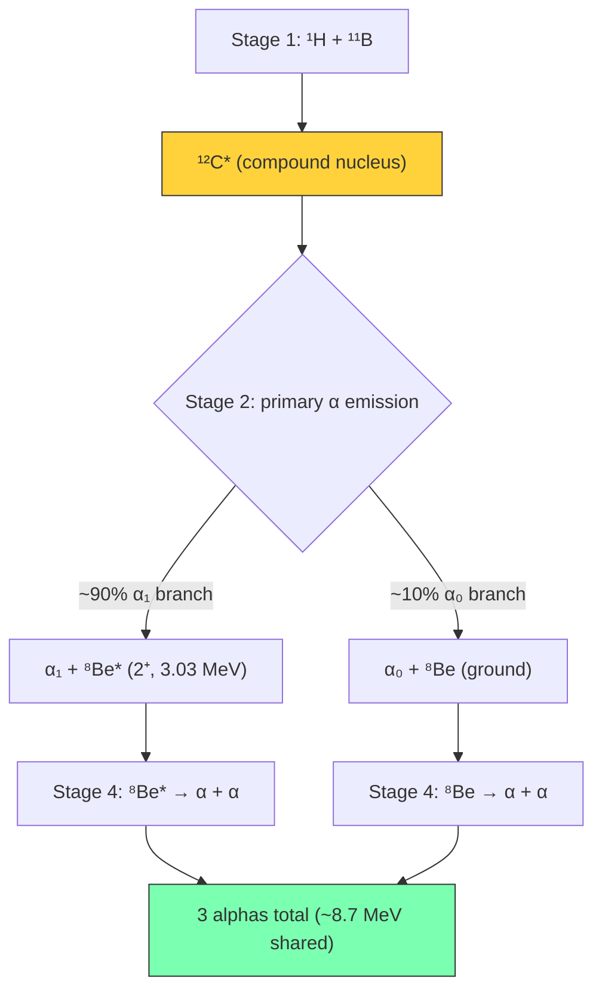
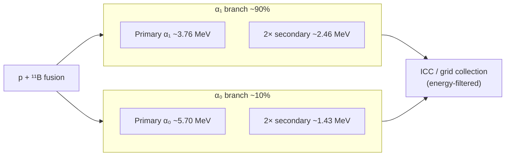
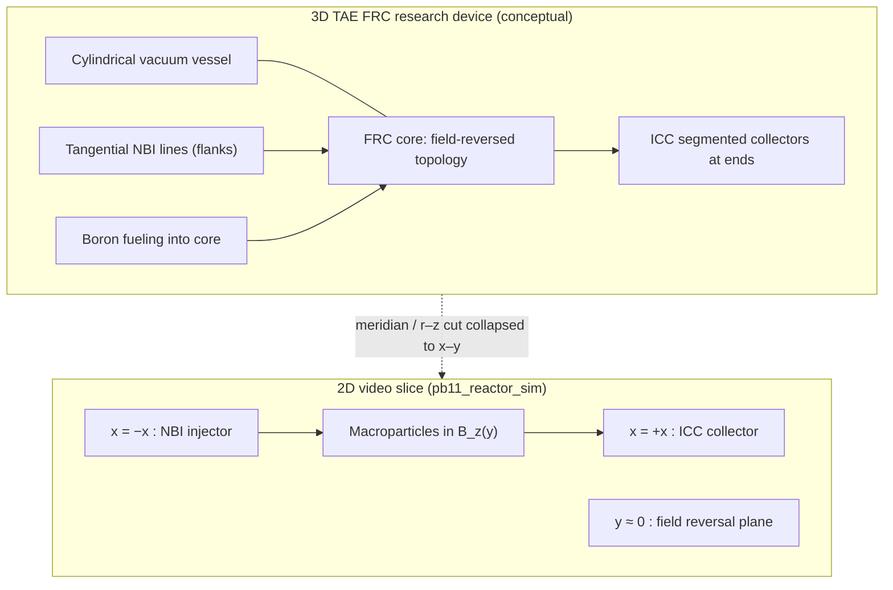
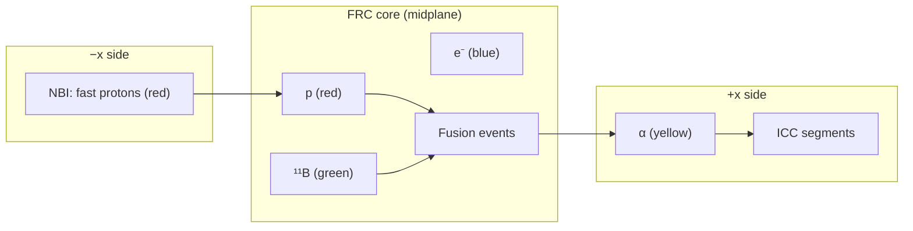
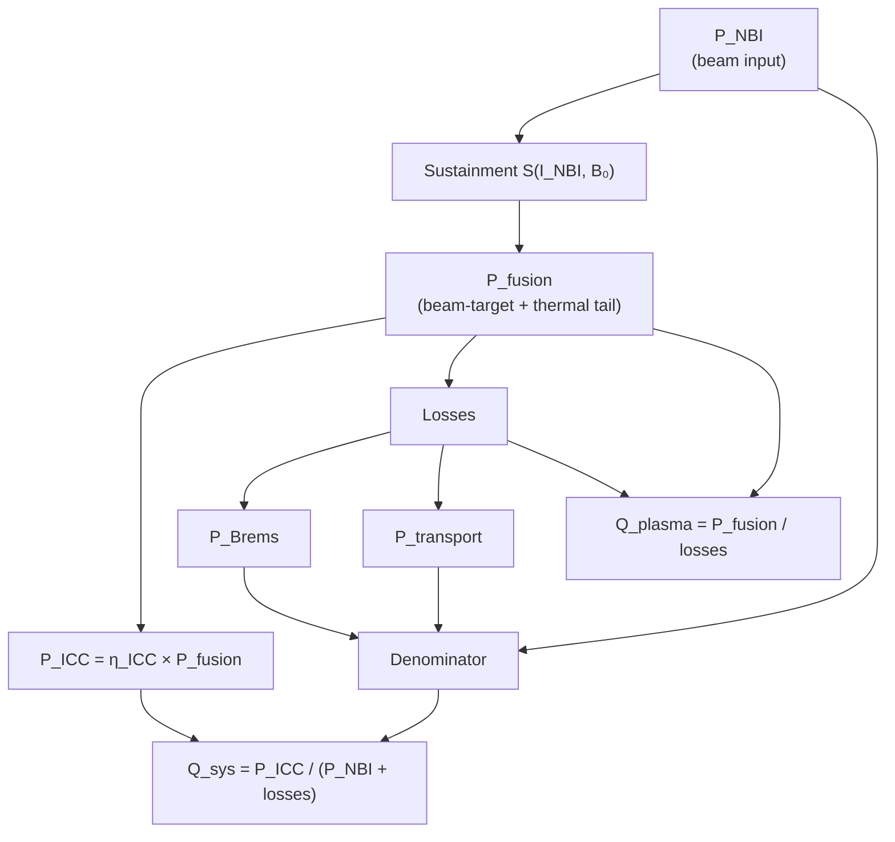
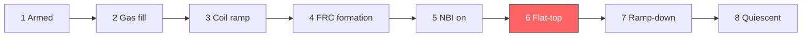

# Simulating Proton–Boron Fusion in a TAE Field-Reversed Configuration

*What a 2D plasma-core model teaches us about aneutronic fusion, beam sustainment, and direct alpha conversion*

---

Most fusion conversations start with deuterium–tritium. I have been exploring something harder and cleaner: **proton–boron-11 (p–¹¹B)** — a reaction that produces **no neutrons**, only charged **helium-4 (alpha) particles** that can—in principle—be converted directly to electricity.

To make that tangible, we built **pb11_reactor_sim**: an open-source GUI that couples a **particle-in-cell (PIC) macroparticle view** to a **0D power-balance model** for three public reactor concepts. This article focuses on **TAE FRC** — a beam-driven **field-reversed configuration (FRC)** aligned with the direction [TAE Technologies](https://tae.com) has described publicly, especially the **Norm** milestone (NBI-only FRC sustainment, 2025).

The simulator is **not** a CAD model of Norm. It is a **teaching slice** of the plasma core: NBI sustainment, p–¹¹B fusion, and **inverse cyclotron converter (ICC)** recovery — exported as a narrated MP4 you can step through callout by callout.

**Repository:** [github.com/catskillsresearch/pb11_reactor_sim](https://github.com/catskillsresearch/pb11_reactor_sim)

---

## Why p–¹¹B is a four-stage chain (not one line in a textbook)

It is tempting to write:

**¹H + ¹¹B → 3α + 8.7 MeV**

In reality, fusion proceeds through **short-lived intermediate nuclei**. That internal structure sets the **alpha energy spectrum** — which matters enormously for **direct energy conversion**, because a collector grid is an energy filter.

### The four stages

1. **¹H + ¹¹B → ¹²C\*** — excited compound nucleus
2. **¹²C\* → α + ⁸Be\*** — primary alpha emission
3. **⁸Be\*** — unbound recoil nucleus
4. **⁸Be\* → α + α** — two secondary alphas

**Net:** three alphas sharing ~8.7 MeV, but **not** with equal energies.



Two branches compete at stage 2:

- **~90% (α₁ branch):** ¹²C\* → α₁ + ⁸Be\*(2⁺, 3.03 MeV) → α₁ + 2α
- **~10% (α₀ branch):** ¹²C\* → α₀ + ⁸Be(ground) → α₀ + 2α



Intermediates live only **10⁻²¹–10⁻¹⁷ s** — far shorter than our 2 ns simulation timestep — so we do **not** transport ¹²C\* or ⁸Be as particles. The reaction is treated as instantaneous **p + ¹¹B → 3α**, while **alpha birth energies** are sampled from the realistic multi-Gaussian spectrum (~2.9 MeV mean per alpha).

**Why that matters for TAE:** ICC and electrostatic collectors respond to **voltage sweeps** the way real hardware would — energetic primaries punch through higher retarding potentials; soft secondaries turn back earlier. Monoenergetic alphas would give an unphysical step-function collection curve.

---

## The real machine (3D) vs. our video (2D)

### What TAE is building (3D research accelerator context)

TAE’s approach is a **compact linear FRC** — a rotating plasma structure whose internal magnetic field **reverses** relative to the applied field (often described as a “smoke ring” in cross-section).

Public milestones relevant here:

- **Norm (2025):** reported **neutral beam injection (NBI)–only** formation, heating, and sustainment of an FRC **without** older end **collision/formation** sections — a simplification TAE describes as a step toward commercial plants ([*Nature Communications*, 2025](https://doi.org/10.1038/s41467-025-58849-5)).
- **Earlier devices (e.g., Norman):** more elaborate end formation; still beam-driven FRC physics.
- **Roadmap names (Copernicus, Da Vinci):** aim at net energy and grid power with thermal wall recovery **plus** direct alpha conversion. **Those full plants are not simulated here.**

A full commercial design harvests energy two ways:

1. **Thermal** — radiation on walls → steam plant
2. **Direct** — fast alphas on open field lines → **ICC** at the ends

**Our module keeps the ICC thread** and omits steam turbines, divertors, vacuum plumbing, and powder-dropper hardware.

### Two fuel paths (protons vs. boron)

p–¹¹B needs **both** hydrogen and boron-11, but engineering separates injection:

| Species | In TAE’s FRC approach | In the simulator |
|--------|------------------------|------------------|
| **Protons** | Tangential **NBI** from machine flanks: accelerate, neutralize, inject, re-ionize in the hot core; beams supply heat, rotation, and current drive | **Red** macroparticles from **−x**; **NBI Current** sets beam energy and rate |
| **Boron-11** | Introduced into the **core** (gas/powder), separate from NBI | **Green** macroparticles in the midplane; **gas fill** raises inventory |

### Mapping the 2D video view to the 3D machine

The dashboard shows a **2D axis-aligned slice** through a cylindrical FRC — a **meridian cut** collapsed for visualization:



| 2D axis in the video | 3D machine meaning |
|---------------------|-------------------|
| **Horizontal (x)** | **Axial** direction along the machine (~1.2 m window) |
| **Vertical (y)** | **Radial-like** coordinate across the **field-reversal plane** (B_z = 0 at midplane) |
| **Color map (B_z)** | Axial magnetic field; yellow (+B) above, purple (−B) below |
| **Left boundary (−x)** | Region where **NBI** enters (labeled *Neutral Beam Proton Injector*) |
| **Right boundary (+x)** | **ICC segmented collector** (8 electrodes) |
| **Top/bottom/left walls** | Grounded **conducting chamber** shell |
| **Colored dots** | **Macroparticles** — each dot = a swarm of real particles |
| **Cyan overlays** | Solid conductors (walls, ICC segments), not particles |

**Reading the motion:**



- **Red + green** = fuel; fusion where they overlap hot and dense
- **Yellow** = fusion product; born in the core, stream **+x** toward ICC
- **Blue** = electrons; their temperature **T_e** drives Bremsstrahlung losses

The **right-hand panel** is not spatial — it is **time history** of the 0D power balance (temperatures, power terms, gain).

---

## Control inputs and the optimum this model finds

Three sliders define the TAE FRC operating point:

| Control | Range | Default | Physical role |
|---------|-------|---------|---------------|
| **NBI Current** | 0–120 A | 40 A | Beam current (normalized). Sets beam energy, fast-ion fraction, input power **P_NBI**, and PIC injection rate |
| **Background B0** | 0.1–5.0 T | 1.5 T | Peak \|B_z\| at flat-top. Enters confinement time **τ_E**, bulk **T_i**, and core density |
| **ICC Coupling** | 0.50–0.95 | 0.85 | **η_ICC**: fraction of fusion power booked as electricity at the collector |

### Beam sustainment (the physics the optimizer discovers)

TAE’s Norm result is **NBI-only sustainment**: the reversed field is **created and held by beam-driven current**, not coils alone. The model uses a sustainment fraction **S(I_NBI, B₀)**:

- Below **~30 A**, **S → 0** — the FRC does not maintain reversal regardless of B₀
- **B₀ cannot substitute for beams**
- Low NBI is legal but **self-penalizing** (τ_E collapses, transport losses rise)

There is **no hard floor** on beam current — the optimizer finds **~55 A** because physics demands it, not because of a constraint.

### Power balance and Q_sys



### Optimum from **Optimize** (current 0D model)

Pressing **Optimize** searches the 3D control space (coarse grid + local refinement, ~1 s, background thread). On the current codebase:

| Parameter | Optimal value |
|-----------|---------------|
| **NBI Current** | **~55 A** |
| **Background B0** | **5.0 T** (slider maximum) |
| **ICC Coupling** | **0.95** (slider maximum) |
| **Q_sys** (system gain) | **~0.066** |

**Q_sys** = P_ICC / (P_NBI + P_Brems + P_transport) — what must exceed 1 for net electricity.

The model is built to explore **proposed** p–¹¹B operating physics on top of Norm-style beam sustainment. The optimizer’s best point in this 0D parameterization still sits **below breakeven** — which is itself the lesson: even with beams, ICC, and aneutronic fuel, **Rider-class difficulty** does not disappear magically. Norm publicly demonstrated **FRC sustainment**, not wall-plug Q ≥ 1 on p–¹¹B.

---

## Output measurement graphs (right-hand diagnostic panel)

All three plots share a **time axis in microseconds (µs)** and update every physics step during the discharge.

### 1. Ion / Electron Temperature (top)

- **T_i** (red) — ion temperature [keV]
- **T_e** (blue) — electron temperature [keV]

**The central tension of p–¹¹B:** ions must reach **~150–300 keV** for fusion; electrons should stay **relatively cold** to limit Bremsstrahlung. Beam-heated ions with cooler electrons are the intended non-thermal path around the classical **Rider limit**.

### 2. Core Power Balance (middle, log scale)

| Trace | Meaning |
|-------|---------|
| **P_fusion** (yellow) | Fusion heating: n_p n_B ⟨σv⟩ E_f, E_f = 8.7 MeV |
| **P_Brems** (pink) | Relativistic Bremsstrahlung ∝ Z_eff² n_e² √T_e |
| **P_cond** (green) | Conduction/transport loss ∝ n_e T_e / τ_E |

### 3. Net Gain Q (bottom, log scale)

- **Q_sys** (solid white) — **plant gain** for TAE: ICC-recovered power vs. beam + losses
- **Q_plasma** (dashed yellow) — fusion physics only: P_fusion / (P_Brems + P_cond); can exceed **Q_sys** by a large factor because **P_NBI** is excluded
- **Dashed grey line at Q = 1** — scientific breakeven reference

**Live readout extras** (left panel): **Sustain**, **P_NBI**, **P_ICC**, **ICC sig** (qualitative AC pickup as alphas cross ICC segments).

---

## Reactor phases in the exported video (8 numbered callouts)

The MP4 walks through a scripted shot. Countdown labels (**T−5**, **T−3**, …) are **control-room shorthand** — sim time is compressed so you reach flat-top in seconds of real time, not minutes.



| Step | Phase | Typical sim duration | What you see and hear |
|------|-------|---------------------|------------------------|
| 1/8 | **Armed** | (held) | Vacuum pumped, gas puffed, coils standby; weak B_z |
| 2/8 | **Gas fill** | 0.8 µs | Boron + hydrogen inventory rises (green population builds) |
| 3/8 | **Coil ramp** | 2.0 µs | b_scale → 1; B_z colormap strengthens |
| 4/8 | **FRC formation** | 3.0 µs | Hot plasma macroparticles seeded; FRC topology appears |
| 5/8 | **NBI on** | 4.0 µs | Fast red protons stream from −x; beam heating begins |
| 6/8 | **Flat-top** | 25 µs | Full discharge: fusion, yellow alphas to ICC, diagnostics live |
| 7/8 | **Ramp-down** | 4 µs | Beams and field fall |
| 8/8 | **Quiescent** | (held) | Plasma quiescing; shot complete |

**Workflow to generate the MP4:** **Optimize** → **Compile** → **Rec Save** (optional **Play**/**Step** for preview). Compile pre-renders frames + voice; export burns numbered subtitles once into the file.

After quiescence, TAE allows a **shortened re-fire** compile (no full arm preamble) — mimicking repeated shots in one vacuum day.

---

## What I take away

1. **p–¹¹B is an engineering spectrum problem**, not just a triple-alpha stoichiometry problem — collection hardware cares about energy distribution.
2. **TAE’s bet is structural:** beam-sustained FRC + separate boron fueling + ICC — our 2D slice makes that story visible.
3. **Simulation ≠ milestone:** Norm proved NBI sustainment; this GUI layers a **proposed** p–¹¹B performance model on top — the optimizer still finds Q_sys ≪ 1 in the current 0D parameterization.
4. **Open tools accelerate intuition** — colored macroparticles, synchronized narration, and diagnostic time histories beat equations alone for building mental models.

Clone the repo, run **Optimize**, **Compile**, and export your own shot. Forks are welcome under Apache 2.0.

---

## References

1. TAE Technologies — company program and public milestones: [tae.com](https://tae.com)
2. TAE Norm / NBI-only FRC sustainment (2025): [Nature Communications, doi:10.1038/s41467-025-58849-5](https://doi.org/10.1038/s41467-025-58849-5)
3. Rider, T. H. — fundamental limits on fusion reactor systems (Rider limit): *Physics of Plasmas* (1995)
4. Nevins, W. M. & Swain, M. — p–¹¹B reactivity and engineering constraints
5. pb11_reactor_sim source, tutorial, and physics notes: [github.com/catskillsresearch/pb11_reactor_sim](https://github.com/catskillsresearch/pb11_reactor_sim)
6. Catskills Research Company — simulation disclaimer: models for theoretical research; not engineering specifications for physical deployment

---

*Disclaimer: pb11_reactor_sim was developed with AI assistance from public documentation. Models are for education and theoretical research — not operational specifications. See the repository LICENSE and NOTICE for full terms.*

*Mermaid diagrams: paste individual ` ```mermaid ` blocks into [Mermaid Live Editor](https://mermaid.live) to render.*
